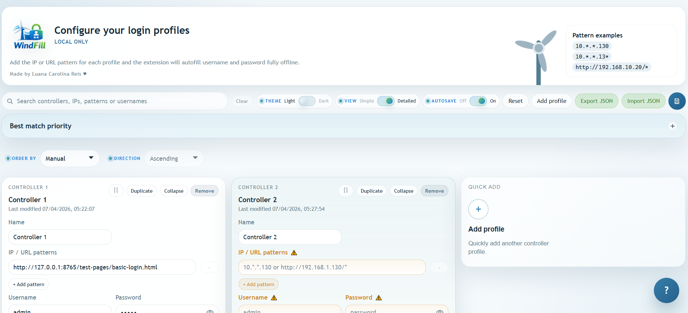
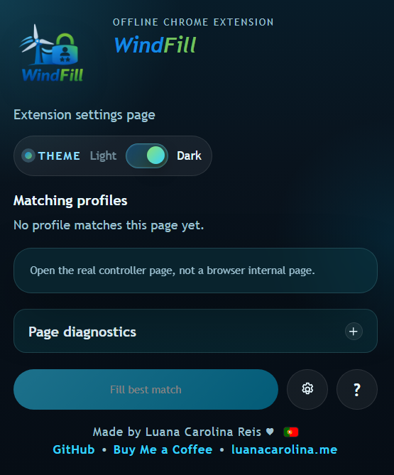

# WindFill

Author: Luana Carolina Reis

WindFill is an offline Chrome extension for autofilling `username` and `password` on internal login pages reached by IP address, hostname, or URL pattern. It is designed for restricted environments where controller pages are accessed directly, connectivity may be limited, and a lightweight local-only workflow is preferred.

Repository status: public and source-available under `PolyForm Noncommercial 1.0.0`. It is not open source.

## Table of contents

- [Preview](#preview)
- [Overview](#overview)
- [Security and privacy](#security-and-privacy)
- [Permission model](#permission-model)
- [Repository review notes](#repository-review-notes)
- [Installation](#installation)
- [Using WindFill](#using-windfill)
- [Pattern examples](#pattern-examples)
- [JSON import and export](#json-import-and-export)
- [Advanced selectors](#advanced-selectors)
- [Test pages](#test-pages)
- [Troubleshooting](#troubleshooting)
- [License and trademarks](#license-and-trademarks)

## Preview

### Options page



### Popup



## Overview

WindFill currently provides:

- Offline credential autofill after installation.
- Local profile storage in `chrome.storage.local`.
- Matching by exact host, wildcard host, exact URL, or wildcard URL.
- Multiple patterns per profile.
- Optional auto-submit after fields are filled.
- A popup with matching profiles, manual fill, and page diagnostics.
- An options page with search, simple/detailed views, autosave, and reset.
- A built-in troubleshooting page.
- JSON import/export for profile transfer between machines.
- A right-click context menu action to trigger fill from the page.
- Local test pages for validation without real controller systems.

## Security and privacy

The statements below describe the current implementation in this repository.

### Current security characteristics

- WindFill is designed to work fully offline after installation.
- No external API, backend, telemetry, analytics, or remote service is used by the extension.
- No `fetch` or `XMLHttpRequest` calls are implemented in the extension code.
- The extension ships as plain HTML, CSS, and JavaScript files stored in this repository.
- No CDN assets, remote scripts, or third-party runtime SDKs are used.

### Data handling

- Profiles and credentials are stored locally in `chrome.storage.local`.
- Exported JSON files contain profile data, including credentials, in plaintext.
- WindFill does not add its own encryption layer to stored credentials.
- Protection of local data therefore depends on the security of the Windows account, Chrome profile, disk, and local machine controls.

### Recommended operational controls

- Use a dedicated Chrome profile for operational access.
- Treat exported JSON files as sensitive secrets.
- Limit access to machines where WindFill profiles are configured.
- Prefer least-privilege controller accounts where possible.
- Review and reload the unpacked extension only from trusted local source.

### Important limitation

WindFill reduces repetitive login work, but it is not a password vault, enterprise secret manager, or endpoint hardening product.

## Permission model

WindFill currently requests the following Chrome permissions:

| Permission | Why it is used |
| --- | --- |
| `storage` | Save profiles, theme preference, autosave preference, and view preference locally. |
| `tabs` | Read the active tab URL and support popup diagnostics/manual fill actions. |
| `scripting` | Reinject the local content scripts when a page was already open before extension reload. |
| `contextMenus` | Provide the right-click action `Fill login with WindFill`. |
| `host_permissions: <all_urls>` | Support direct-IP, internal hostname, HTTP, and HTTPS login pages across different controller environments. |
| `content_scripts: <all_urls>` | Detect matching pages and perform local autofill on supported login pages. |

Notes for reviewers:

- `"<all_urls>"` is used because target systems may vary by IP, hostname, path, and protocol.
- In a controlled deployment with a fixed target estate, the manifest can be narrowed in a private review build before installation.

## Repository review notes

This repository is intentionally easy to inspect:

- Runtime code is committed directly in source form.
- No build tool is required to understand extension behavior.
- No package manager install is required for the extension itself.
- The release ZIP is created by archiving repository files, not by bundling hidden generated code.

## Installation

### Clone the repository

```powershell
git clone https://github.com/luanacarolinareis/WindFill.git
cd WindFill
```

### Load unpacked

1. Open `chrome://extensions`.
2. Enable `Developer mode`.
3. Click `Load unpacked`.
4. Select the repository root.
5. Open the extension options page and configure the required profiles.

### Package as CRX

If the target environment blocks `Load unpacked`, package the same source as a `.crx`:

1. Open `chrome://extensions`.
2. Enable `Developer mode`.
3. Click `Pack extension`.
4. Choose the repository root as the extension root.
5. Chrome will generate a `.crx` and a private key file.

## Using WindFill

### Popup

The popup is intended for fast checks and manual actions on the current tab.

- Shows the current page URL.
- Shows matching profiles for the current page.
- Includes `Fill best match` for manual execution.
- Includes a collapsible `Page diagnostics` section.
- Includes quick access to `Options` and built-in `Troubleshooting`.
- Includes a theme toggle.

### Options page

The options page is the main configuration surface.

- Create and remove any number of profiles.
- Add multiple match patterns per profile.
- Search by controller name, pattern, username, or selector text.
- Switch between `Simple` and `Detailed` profile views.
- Enable or disable `Autosave`.
- Use the save button for an immediate manual save.
- Use `Reset` to restore the starter list and default UI settings.

### Right-click action

WindFill also adds a context menu action:

1. Right-click on a page or editable field.
2. Choose `Fill login with WindFill`.

This uses the matching saved profile for that page and attempts to fill the visible login form directly from the DOM.

## Pattern examples

- Exact IP host: `192.168.1.10`
- Wildcard IP host: `10.0.0.*`
- Full URL pattern: `http://192.168.1.10/*`
- HTTPS URL pattern: `https://controller.local/*`
- Specific controller host example: `10.*.*.130`
- Short wildcard example: `10.*.*.13*`

In the options UI, each pattern is added on its own line. In stored JSON, `matchPattern` may still contain multiple patterns separated by commas or new lines.

## JSON import and export

The options page can export the current profile list to JSON and import it later on the same machine or another machine.

### Export

1. Open the options page.
2. Make sure the desired profiles are already saved.
3. Click `Export JSON`.
4. The browser downloads `controller-autofill-profiles.json`.

Typical use cases:

- backups before editing
- profile transfer between systems
- maintaining a master offline controller list

### Import

1. Open the options page.
2. Click `Import JSON`.
3. Select a previously exported `.json` file.
4. WindFill loads the profiles and saves them locally.

Important notes:

- Import replaces the current in-memory list shown in the options page.
- Imported profiles are then saved to `chrome.storage.local`.
- Invalid JSON or non-array payloads are rejected.

### Example format

```json
[
  {
    "id": "profile-example-1",
    "name": "Main controller",
    "matchPattern": "http://192.168.1.10/*",
    "username": "admin",
    "password": "secret",
    "usernameSelector": "",
    "passwordSelector": "",
    "submitSelector": "",
    "autoSubmit": false,
    "enabled": true,
    "overwriteExisting": true
  }
]
```

## Advanced selectors

Most simple login pages should work without selectors. If a page uses unusual field names or structure, configure:

- `Username selector`
- `Password selector`
- `Submit selector`

Examples:

- `#username`
- `input[name="username"]`
- `#device-key`
- `input[type="password"]`
- `button[type="submit"]`

### Finding selectors in Chrome

1. Open the target login page.
2. Right-click the field and choose `Inspect`.
3. Look for stable attributes such as `id`, `name`, `type`, or `placeholder`.
4. Prefer short, stable selectors over long structural selectors.

Good:

- `#user`
- `input[name="operator-code"]`
- `button[type="submit"]`

Avoid:

- `div > div > form > input:nth-child(2)`
- `.panel .row .field input`

## Test pages

Local test pages are included in [test-pages](test-pages).

Start a local server from the repository root:

```powershell
python -m http.server 8765 --bind 127.0.0.1
```

Then open:

- `http://127.0.0.1:8765/test-pages/basic-login.html`
- `http://127.0.0.1:8765/test-pages/selector-login.html`

For test-page-specific instructions, see [test-pages/README.md](test-pages/README.md).

## Troubleshooting

For common issues and quick fixes, see [TROUBLESHOOTING.md](TROUBLESHOOTING.md).

## License and trademarks

- Source code license: [PolyForm Noncommercial 1.0.0](LICENSE.md)
- Required notices: [NOTICE](NOTICE)
- Branding and naming rules: [TRADEMARKS.md](TRADEMARKS.md)

Summary:

- the code is publicly visible on GitHub
- noncommercial use is governed by PolyForm Noncommercial 1.0.0
- commercial or business use requires separate written permission
- `WindFill`, its logo, icons, and branding are not licensed with the source code
